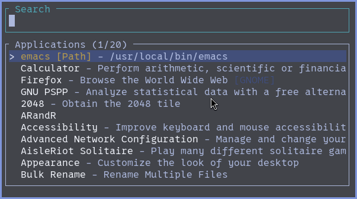

# exek

A fast TUI application launcher with fuzzy matching and frecency-based sorting.



## Features

- **Fuzzy matching** - Find applications quickly by typing partial names
- **Frecency sorting** - Combines frequency and recency to prioritize often-used apps
- **Path autocompletion** - Browse and execute files by typing paths (/, ./, ~/)
- **XDG Desktop file support** - Automatically discovers applications from standard locations
- **Terminal app support** - Correctly launches terminal applications
- **Fast and lightweight** - Written in Rust for speed and efficiency

## Installation

### Quick Install (Interactive)

```bash
./install.sh
```

This will guide you through the installation process and let you choose where to install.

### Using Make

```bash
# Default installation to /usr/local (requires sudo)
sudo make install

# Install to custom prefix
make PREFIX=/usr install          # System-wide to /usr
make PREFIX=~/.local install       # User installation (no sudo needed)
make PREFIX=/opt/exek install     # Custom location

# Uninstall
sudo make uninstall
```

### Manual Installation

```bash
# Build the binary
cargo build --release

# Install to desired location
sudo cp target/release/exek /usr/local/bin/
# OR for user installation:
cp target/release/exek ~/.local/bin/
```

### Installation Options

| Method | Command | Requires sudo | Location |
|--------|---------|--------------|----------|
| System-wide (default) | `sudo make install` | Yes | `/usr/local/bin` |
| System packages | `sudo make PREFIX=/usr install` | Yes | `/usr/bin` |
| User installation | `make PREFIX=~/.local install` | No | `~/.local/bin` |
| Interactive | `./install.sh` | Depends | You choose |

## Usage

Simply run `exek` from your terminal:

```bash
exek
```

### Keybindings

- **Type** to search for applications
- **/, ./, ~/** - Switch to path completion mode
- **↑/↓** or **Ctrl+k/j** - Navigate through results
- **Tab** - Apply directory completion (in path mode)
- **Enter** - Launch selected application or execute file
- **Esc** or **Ctrl+c** - Exit
- **Backspace/Delete** - Edit search query
- **←/→** - Move cursor in search box
- **Home/End** - Jump to start/end of search

## How it works

exek scans standard XDG desktop file locations:
- `/usr/share/applications`
- `/usr/local/share/applications`
- `~/.local/share/applications`
- Flatpak application directories

It maintains a usage database to track:
- Launch count for each application
- Last launch time
- Calculates frecency scores to prioritize frequently and recently used apps

## Building from source

Requirements:
- Rust 1.70+
- Cargo

```bash
git clone <repo>
cd exek
cargo build --release
```

## License

BSD
